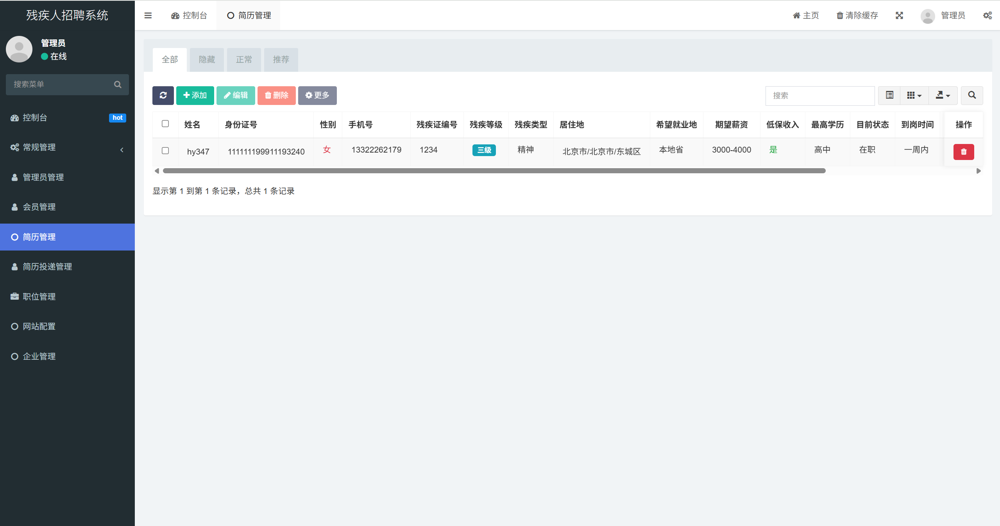

# 残疾人招聘系统文档

本系统致力于为残疾人提供公平就业机会，帮助雇主与支持代表建立联系。基于 [Vant](https://vant-contrib.gitee.io/vant/v3) 和 [FastAdmin](https://www.fastadmin.net/)，注重无障碍体验与数据完整性。

## 📌 目录

- [概览](#概览)
- [主要特性](#主要特性)
- [模块结构](#模块结构)
  - [注册模块](#注册模块)
  - [简历模块](#简历模块)
  - [雇主门户](#雇主门户)
  - [推广功能](#推广功能)
- [数据库模型](#数据库模型)
- [无障碍与可访问性](#无障碍与可访问性)
- [截图示例](#截图示例)
- [贡献指南](#贡献指南)
- [许可证](#许可证)

## 概览

该系统旨在：

✅ 促进残疾人就业  
✅ 提供雇主与支持代表的全流程管理  
✅ 确保数据安全、易用、可扩展  
✅ 基于前后端分离架构，支持社区二次开发

## 主要特性

- 📝 **多角色注册**：支持残疾人、雇主、支持代表三方角色
- 🔒 **注册审批机制**：所有角色均需后台审核通过后，方可登录
- 💼 **简历管理**：残疾人用户可详细填写和更新个人简历
- 📢 **职位发布**：雇主可发布岗位需求、福利待遇及公司介绍
- 🌟 **推广机制**：每位用户可分享专属推荐链接，系统记录推荐奖励
- 🖼️ **无障碍优化**：适配屏幕阅读器，移动端友好体验

## 模块结构

### 注册模块

- 📍 **导航栏**：注册页面包含导航栏，便于页面切换  
- 👤 **三种角色**：
  - **残疾人**  
    - 选择残疾类型（视力、听力、言语、肢体、智力、精神、多重）  
    - 选择残疾等级（1-4 级）  
    - 默认头像：灰色剪影  
    - 注册成功提示：  
      > “注册成功。我们的专职人员将尽快与您联系，帮助您找到理想的工作。”
  - **雇主**  
    - 注册成功提示：  
      > “感谢您为残疾朋友提供就业岗位。我们的专职人员将尽快与您联系并提供服务，请稍后登录。”
  - **支持代表**  
    - 注册成功提示：  
      > “感谢您为残疾人就业贡献力量。我们的专职人员将尽快与您联系并提供个性化服务，请稍后登录。”
- ⚠️ **待审核提示**：  
  > “请等待我们的专职人员与您联系后再进行登录。”

### 简历模块

- 📍 **居住地**：下拉选择省、市、区（`fa_area` 表）  
- 🎓 **最高学历**：小学、初中、高中、中专、大专、本科、硕士、博士  
- 📌 **当前状态**：在职 / 待业  
- 🏙️ **期望工作城市**：本市 / 本省 / 外省 / 全国（多选）  
- 🕒 **到岗时间**：立即 / 一周内 / 一个月内  
- 📆 **工作年限**：数字输入（如“5”）  
- 💬 **特殊要求**：默认“无夜班”，可自定义编辑  

✅ 数据表：`fa_resume`（与 `fa_user` 通过 `user_id` 关联）

### 雇主门户

- 🚫 **登录限制**：审核通过前不可登录
- 📝 **职位发布流程**：
  1️⃣ **职位描述**  
      - 职位名称  
      - 职位描述  
      - 工作地点  
      - 工作时间  
      - 公司薪资  
      - 公司福利（多选：五险一金、包吃、包住、补贴、体检、带薪休假、年终奖）  
      - 其他福利  
  2️⃣ **人员要求**  
      - 年龄要求  
      - 性别要求  
      - 残疾类型（不限 / 指定）  
      - 残疾等级（不限 / 指定）  
      - 学历要求  
      - 其他要求  
  3️⃣ **公司介绍**  
      - 公司名称（示例：“北京XXXX科技有限公司”）  
      - 公司地址（省、市、区）  
      - 公司规模（如“50-100人”）  
      - 主营业务  

- 🔍 **简历查看**：登录后可查看候选人简历（`fa_resume` + `fa_work_experience`）

### 推广功能

- 🔗 **专属推广链接**：`fa_user.reg_url`  
- 🖼️ **推广海报**：可生成分享式点击海报（`fa_attachment` 表）  
- 📈 **推广记录**：`fa_referrals` 表，记录推荐人 ID 与被推荐人 ID、奖励状态  

## 数据库模型

- **`fa_user`**：用户基础信息  
- **`fa_resume`**：残疾人简历信息  
- **`fa_job`**：雇主发布的岗位信息  
- **`fa_area`**：行政区域信息  
- **`fa_work_experience`**：工作经历表  
- **`fa_referrals`**：推广推荐关系表  
- **`fa_attachment`**：用于存储推广海报等图片资源  

## 界面展示

下面是系统主要界面的截图示例，帮助直观理解系统功能与界面布局。

### 职位浏览

### 个人信息页面

### 后台管理界面

